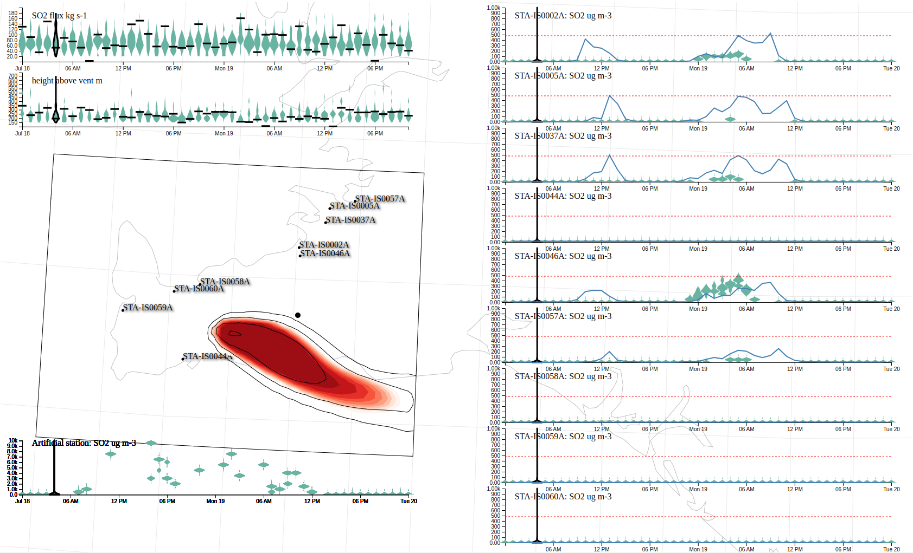

# ST540105 visualize.py
UNDER DEVELOPMENT! CURRENTLY ONLY VERY BASIC IMPLEMENTATION

A repository for displaying the posterior distribution over Eruption Source Parameters (ESPs) and ground $SO_2$ concentrations in an interactive website. The respository consists of a website that visualises the probability distributions as time series of violin plots and maps of exceedence probabilities and concentrations, and an API that allows the user to 
 * select a particular emulator (Fall3D, Gaussian Plume model, etc.) 
 * select a particular date range 
 * select excedence threshold for plotting probability contours on map
 * select a particular sample from the posterior distribution and plot the ESP timeseries and concentration contours on map (i.e. selecting an individual scenario from an ensemble)
 * modify any of the plume heights and fluxes from a particular sample and see the effect in real time on the map (this is made possible by using a fast emulator inhstead of the full model)

The website is implemented in D3.js, the backend API in python using FastAPI.  

## To do
 * Most things! currently only basic user interaction is implemented
 
## Package structure

    ST540206/
    ├── environment.yaml      - configures conda environment with required packages
    ├── LICENSE               - GPL 3
    ├── app                   
    │   └── main.py           - python FastAPI app
    ├── static                - static files served up by the server
    │   ├── test2.html        - website
    │   └── data.json         - data for plotting
    ├── README.md             - this file
    ├── .gitignore            - files to be ignored by git
    ├── emulator.nc           - data used by the emulator
    └── screenshot.png        - screenshot of the website in use

## To download the repository
Clone the repository to your machine

    git clone https://github.com/profskipulag/ST540105.git

You will be asked for your username and password. For the password github now requires a token:
- on github, click yur user icon in the top right corner
- settings -> developer settings -> personal access tokens -> Tokens (classic) -> Generate new token -> Generate new token (classic) 
- enter you authentifcation code
- under note give it a name, click "repo" to select al check boxes, then click generate token
- copy result enter it as password
- IMPORTANT - unzip emulator_data.zip

## To run the server
Create a new conda environment from the environment.yaml file:

    conda env create -f environment.yaml

Activate the environment

    conda activate st540105
    
Start the server

    uvicorn app.main:app --host 0.0.0.0 --port 8080
    
Then navigate to this address in your browser

    http://0.0.0.0:8080/static/test2.html

The page should look like this

Click on one of the violins to change the date, this will change the exceedence probailities shown on the map by the filled contours. Click and drag the horizontal lines on the violin plot to change the plume height and flux for that date - if you do this for the date an hour or two before the date you have selected you will see the concentration contours (black lines) change in near real time.